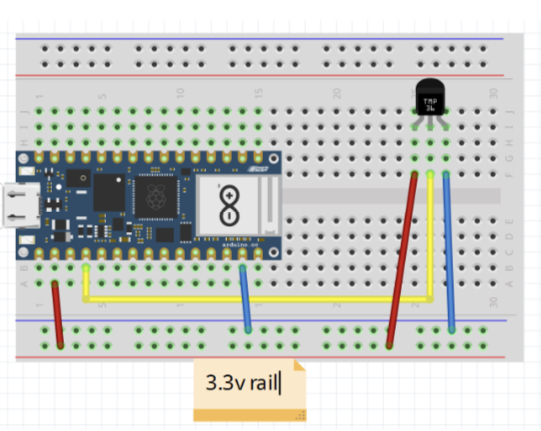
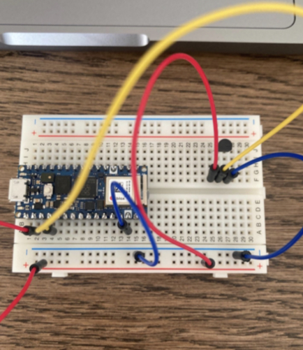
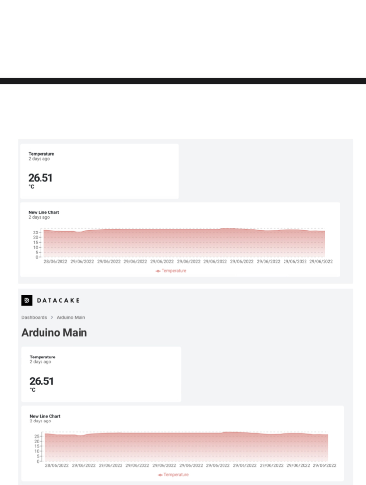

## Temperature-meter for apartment

Yuusuf Dahlstrand - yd222ce
Tillämpad Internet of Things, Introduktionskurs, 7.5hp Sommar 2022
Examinator Fredrik Ahlgren
Linnaeus University

The temperature-meter is built from an Arduino RP2040 board bundled with the recommended sensors kit supplied by Elektrokit. This kit includes a temperature sensor which have been used in this project. To visualize the data I have used Datacake.

Since the delivery of materials was postponed from Electrokit, it took me some time to get started with the actual project. However, after starting the project most things went relatively smoothly. There were some problems setting up the code but it was easily solved with a couple of flashes.

#### Objective of this project

This project aims to showcase how to build a temperature-meter, which in my case will be used for measuring temperature in my apartment. Being able to track the temperature at all times, even when I’m not home, and storing this data as well as visualizing it will make it possible for me to improve the climate in my apartment. This will also make it possible for me to evaluate how my improvements reflect themselves in actual temperature. The report will also include a tutorial for others to replicate if they so wish. It was a lot easier and more fun than I could have imagined and I will most definitely improve my IoT device and have some fun with it after this course.

#### Materials

Arduino Nano RP2040 Connect (with headers)
The Arduino board has WiFi support and makes it possible to gather the data from the sensor as well as sending the data to a cloud in order to visualize it.

Apple iPhone 5W Power Supply Adapter & USB-microUSB cable 
This will supply power and the USB to microUSB cable will also be used for setting the board up.

Breadboard & Jumper wires
This makes connecting the temperature sensor to the board a lot easier and without soldering. Also makes it easier to see how the board and sensor is connected.

Temperature sensor MCP9700
This temperature sensor has an accuracy of +- 4 degrees Celsius and uses 2.3-5.5V.
More information about the sensor can be found at https://www.microchip.com/en-us/product/MCP9700#.
Computer-side setup

For the setup I used OpenMV to flash (install latest firmware of MicroPython) on the arduino board and to code it I used the Thonny IDE. OpenMV was used because I heard some people having trouble finding the device with Thonny. A Datacake account was made in order to visualize the data.

#### Assembly

The assembly was pretty straight forward with the breadboard and jumper wires. I only installed a temperature meter and the circuit diagram can be found in the image below:

Picture of my own assembly:

Data Visualization Platform

I used Datacake to save and visualize the data gathered. I chose Datacake because I have heard from a TA that a lot of companies use it for work and because of this it seemed relevant to me as I would like to simulate a real use case. Datacake was very easy to set up with a user-friendly backend interface for the dashboard. I put a live value as well as a diagram on my dashboard. Datacake gives full freedom to customize the dashboard and because of this I would definitely recommend it.

#### Code used

See main.py, config.py, boot.py

#### Data transmitted

The board will read the temperature with a 500ms interval between readings. The readings are saved in an array of size 10 and when the array is full an average is calculated and sent to Datacake. The reason for the short intervals is that I want my graph to be as accurate as possible. I used the MQTT protocol to send the data to Datacake.

#### Data presented

I use a real time value meter and a linear graph to visualize the data in Datacake.

#### Conclusion

I have built a temperature-meter that sends the data to Datacake via WiFi where the data is visualized by showing the temperature differences in a graph. I had a lot of fun but found that a more accurate sensor would have been even better. I am thinking about getting a smart AC which I could program to work with the sensor in order to achieve the perfect temperature in the apartment at all times. However that will be a project for another time. Though I have understood that getting into IoT is not as hard as one might think and this has pushed me to hopefully persure my own projects in the IoT sphere.

